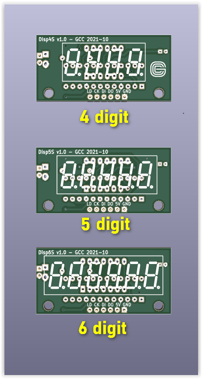
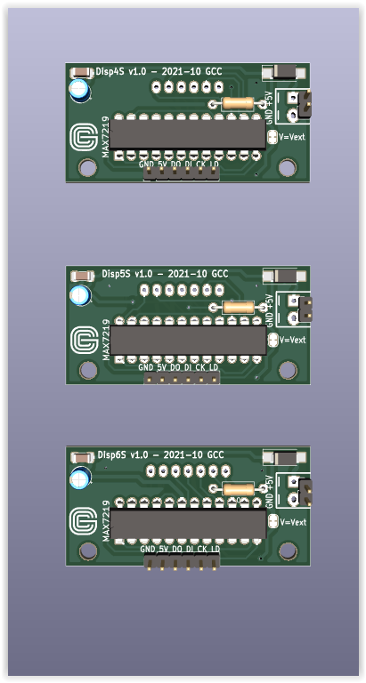
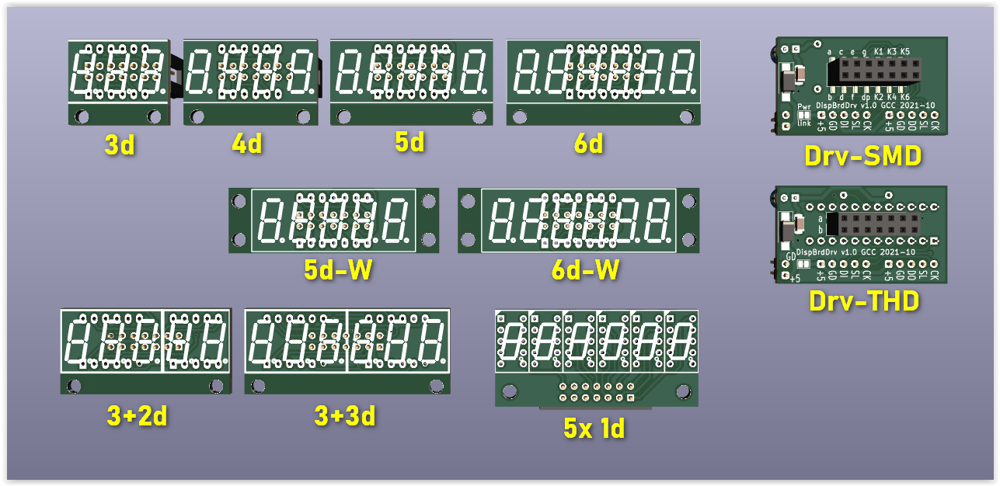
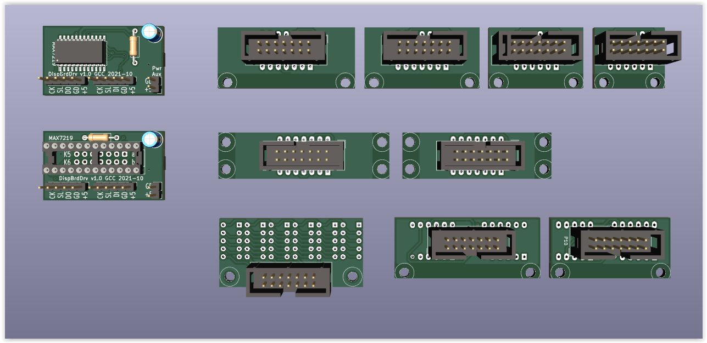

## General description
This repository contains the [KiCad](https://www.kicad.org/) projects (Schematics, PCBs, Gerber files) for a variety of generic 3- to 6-digit display panels.

There are two types of designs: _One-piece_ and _Modular_. The former is a complete panel, the latter has a 
separate driver board that fits any of the different display carrier boards.

## Common features
 * MAX7219 drivers _(DIP for one-piece, DIP or SMD variants for modular)_
 * 0.36" LED displays
 * Several combinations of display components for a given number of digits _(see list below)_
 
## Display Variants
The LED display types to be mounted are listed below for each variant.

#### One-piece design:
 * 1x 4-digit
 * 1x 5-digit
 * 1x 6-digit

 

#### Modular design:
 * 1x 3-digit
 * 1x 4-digit
 * 1x 5-digit
 * 1x 6-digit
 * 1x 5-digit, side mounting holes
 * 1x 6-digit, side mounting holes
 * 1x 3-digit + 1x 2-digit
 * 2x 3-digit
 * 6x 1-digit

 
#### Notes:
 * **_Displays must be common CATHODE._**
 * some LED display sizes have compatible pinout, in particular:
    * A 3-digit display can be mounted in place of a 4- or 5-digit display, but the rightmost digit will then  correspond to digit #2 or #3 (i.e. 1 or 2 rightmost digits are lost)
    * A 4-digit display can be mounted in place of a 5-digit display, same caveats as above.
 
## Components
Beside the MAX7219 ICs and the LED displays of the chosen types, other components required are:

|Qty |Value |Desc |
|-----|-------|------|
| 1x |10uF/16V THD |Electrolytic capacitor|
| 1x |100nF 1206 SMD |Ceramic capacitor (MLCC)|
| 1x |10k 0.25W THD|Resistor(*)|
|    |0.1" |F header strips, tulip type (for display sockets)|
|    |0.1" |M/F (as required) connectors or header strips for board-to-board and external connections|

(*) The resistor value might have to be adjusted according to the displays used in order to obtain the desired brightness; please refer to the MAX7219 datasheet for further details.

### Notes
The designs can be opened and modified with [__KiCad version 5.99__ nightly build](https://kicad-downloads.s3.cern.ch/index.html?prefix=windows/nightly/) (soon to become 6.0 official);
make sure that you use a build that is more recent than Nov 1st 2021.
KiCad is not required if you are just interested in having the PCBs manufactured; a .zip with set of ready Gerber files is provided (compliant with the requirements of the JLCPCB online ordering service, but also of other online services). However, having KiCad installed allows you to modify the design, reissue the Gerber files and check them with the integrated Gerber viewer.

### License

This work is licensed under a [Creative Commons Attribution-ShareAlike 4.0 International License](http://creativecommons.org/licenses/by-sa/4.0/).

